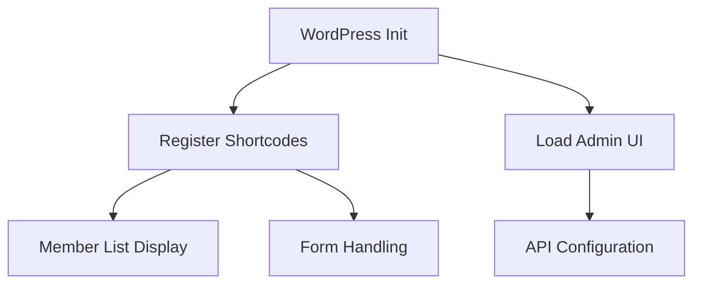

# Webling WordPress Plugin Technical Documentation

## Overview
This plugin integrates Webling membership management features into WordPress using the official Webling PHP API client (`usystems/webling-api-php` v1.3.0).

## Table of Contents
1. [API Integration](#api-integration)
2. [Plugin Architecture](#plugin-architecture)
3. [Member List Implementation](#member-list-implementation)
4. [Form Handling](#form-handling)
5. [Caching Mechanism](#caching-mechanism)
6. [Security Considerations](#security-considerations)

## API Integration

### Composer Dependency Setup
```php
// examples/example_3_webling-plugin/composer.json
{
    "minimum-stability": "dev",
    "require": {
        "usystems/webling-api-php": "1.3.0",
        "php": ">=5.4.0"
    }
}
```

### Client Configuration
```php
// webling.php
$client = new Webling\API\Client(
    get_option('webling_hostname'), 
    get_option('webling_apikey'),
    [
        'connecttimeout' => 15,
        'timeout' => 30,
        'useragent' => 'Webling WordPress Plugin/3.9.0',
        'ssl_verify' => WP_DEBUG ? false : true
    ]
);

// Custom WordPress cache adapter
$adapter = new WordpressCacheAdapter();
$cache = new Webling\Cache\Cache($client, $adapter);
```

### Key API Operations
```php
// src/helpers/WeblingApiHelper.php
public function getMember($memberId) {
    return $this->cache->getObject('member', $memberId);
}

public function createMember($data) {
    return $this->client->post('/member', $data);
}

public function updateMember($memberId, $data) {
    try {
        return $this->client->put("/member/$memberId", $data);
    } catch (Webling\API\ClientException $e) {
        error_log("Member update failed: " . $e->getMessage());
        return false;
    }
}

public function deleteMember($memberId) {
    $response = $this->client->delete("/member/$memberId");
    return $response->getStatusCode() === 200;
}

public function getGroups() {
    return $this->cache->getRoot('membergroup')['children'];
}
```

## Plugin Architecture

### Core Components
```
├── src/
│   ├── helpers/        # API handlers and utilities
│   ├── shortcodes/     # Frontend components
│   ├── admin/          # Settings UI
│   └── WeblingAPI/     # Custom cache adapter
```

### Main Plugin Workflow


## Member List Implementation

### Shortcode Handler
```php
// src/shortcodes/webling_memberlist.php
add_shortcode('webling_memberlist', function($attrs) {
    $helper = new WeblingMemberlistHelper();
    return $helper->renderMemberlist($attrs['id']);
});

// Example cached query
$members = $cache->getRoot('member');
```

### Display Template
```php
// examples/example_3_webling-plugin/src/shortcodes/webling_memberlist.php
foreach ($members as $memberId) {
    $member = $cache->getObject('member', $memberId);
    echo '<div class="member-card">';
    echo '<h3 class="member-name">' 
        . esc_html($member['properties']['Vorname'] . ' ' . $member['properties']['Name']) 
        . '</h3>';
    
    echo '<div class="member-details">';
    if (!empty($member['properties']['Email'])) {
        echo '<p class="member-email">' . esc_html($member['properties']['Email']) . '</p>';
    }
    if (!empty($member['properties']['Telefon'])) {
        echo '<p class="member-phone">' . esc_html($member['properties']['Telefon']) . '</p>';
    }
    if (!empty($member['properties']['Mitgliedschaft'])) {
        echo '<p class="member-type">' 
            . esc_html($member['properties']['Mitgliedschaft']['value']) 
            . '</p>';
    }
    echo '</div>';
    
    if (!empty($member['properties']['Mitgliederbild'])) {
        echo '';
    }
    echo '</div>';
}
```

## Form Handling

### Field Configuration Example
```php
// examples/example_3_webling-plugin/src/admin/pages/form_edit.php
$fields = [
    'vorname' => [
        'type' => 'text',
        'label' => __('First Name', 'webling'),
        'required' => true,
        'maxlength' => 50
    ],
    'email' => [
        'type' => 'email',
        'label' => __('Email Address', 'webling'),
        'validation' => '/^[^@]+@[^@]+\.[a-z]+$/i'
    ],
    'mitgliedschaft' => [
        'type' => 'select',
        'label' => __('Membership Type', 'webling'),
        'options' => [
            'regular' => __('Regular Member', 'webling'),
            'student' => __('Student Member', 'webling')
        ]
    ]
];
```

### Form Rendering Example
```php
// examples/example_3_webling-plugin/src/shortcodes/webling_form.php
add_shortcode('webling_form', function($attrs) {
    ob_start();
    ?>
    <form class="webling-member-form" method="post" action="<?php echo admin_url('admin-post.php'); ?>">
        <input type="hidden" name="action" value="webling_form_submit">
        <?php wp_nonce_field('webling_form_submit'); ?>
        
        <div class="form-group">
            <label for="firstname"><?php _e('First Name', 'webling'); ?></label>
            <input type="text" name="firstname" required 
                class="form-control" 
                pattern="[A-Za-z\u00C0-\u00FF\- ]{2,50}">
        </div>
        
        <div class="form-group">
            <label for="email"><?php _e('Email', 'webling'); ?></label>
            <input type="email" name="email" required 
                class="form-control"
                placeholder="example@domain.com">
        </div>
        
        <button type="submit" class="btn btn-primary">
            <?php _e('Submit Application', 'webling'); ?>
        </button>
    </form>
    <?php
    return ob_get_clean();
});
```

### Submission Workflow
2. Data validated server-side
3. API POST to Webling's /member endpoint
4. Confirmation email triggered

```php
// src/actions/webling_form_submit.php
$response = $api->post('/member', [
    'properties' => [
        'Vorname' => sanitize_text_field($_POST['firstname']),
        'Name' => sanitize_text_field($_POST['lastname']),
        // ... other fields
    ]
]);
```

## Caching Mechanism

### Cache Key Implementation
```php
// examples/example_3_webling-plugin/src/WeblingAPI/WordpressCacheAdapter.php
public function generateKey($type, $id = null) {
    $prefix = 'webling_';
    $blog_id = get_current_blog_id();
    $key = "{$prefix}{$blog_id}_{$type}";
    if ($id) {
        $key .= "_" . (is_array($id) ? implode('-', $id) : $id);
    }
    return substr($key, 0, 172); // Max key length for some caching systems
}
```

### Custom WordPress Adapter
```php
// src/WeblingAPI/WordpressCacheAdapter.php
class WordpressCacheAdapter implements ICacheAdapter {
    public function set($key, $value, $ttl = 3600) {
        return wp_cache_set($key, $value, 'webling_api', $ttl);
    }
    
    public function get($key) {
        return wp_cache_get($key, 'webling_api');
    }
}
```

### Cache Management Example
```php
// examples/example_3_webling-plugin/src/actions/webling_form_submit.php
add_action('admin_post_webling_form', function() {
    // Process form submission...
    
    // Clear relevant cache after successful submission
    if ($response->getStatusCode() === 201) {
        $cache->clear('member');
        $cache->clear('membergroup');
    }
});

// examples/example_3_webling-plugin/src/helpers/WeblingMemberlistHelper.php
public function renderMemberlist($listId) {
    $cacheKey = "memberlist_$listId";
    if ($cached = $this->cache->get($cacheKey)) {
        return $cached;
    }
    
    // Generate fresh content
    $content = $this->generateMemberlist($listId);
    
    // Cache for 1 hour
    $this->cache->set($cacheKey, $content, 3600);
    return $content;
}
```

### Cache Management
- Manual clear via admin UI
- 1-hour default TTL for API responses

## Security Considerations

### Nonce Verification Implementation
```php
// src/shortcodes/webling_form.php
add_shortcode('webling_form', function($attrs) {
    wp_nonce_field('webling_form_submit', 'webling_nonce');
    // ... form fields
});

// src/actions/webling_form_submit.php
add_action('admin_post_webling_form', function() {
    if (!wp_verify_nonce($_POST['webling_nonce'], 'webling_form_submit')) {
        wp_die(__('Security verification failed', 'webling'));
    }
    // ... process form
});
```

1. API Key Protection
   - Stored encrypted in WordPress options table
   - Never exposed in frontend code

2. Input Sanitization
```php
add_filter('webling_form_input', function($input) {
    return is_array($input) ? 
        array_map('sanitize_text_field', $input) : 
        sanitize_text_field($input);
});
```

3. Rate Limiting
   - 5 requests/second maximum
   - Exponential backoff on API errors

## Advanced Configuration

### Custom Endpoint Hooks
```php
// Example: Add custom API endpoints
add_action('rest_api_init', function() {
    register_rest_route('webling/v1', '/member/(?P<id>\d+)', [
        'methods' => 'GET',
        'callback' => 'webling_get_member_api',
        'permission_callback' => '__return_true'
    ]);
});

function webling_get_member_api($request) {
    $helper = new WeblingApiHelper();
    return $helper->getMember($request['id']);
}
```

## Troubleshooting

### Common Error Codes
| Code | Meaning | Resolution |
|------|---------|------------|
| 401  | Invalid API key | Verify plugin settings |
| 404  | Object not found | Check cache validity |
| 429  | Rate limit exceeded | Implement backoff |

[View Full API Documentation](https://demo.webling.ch/api/)
