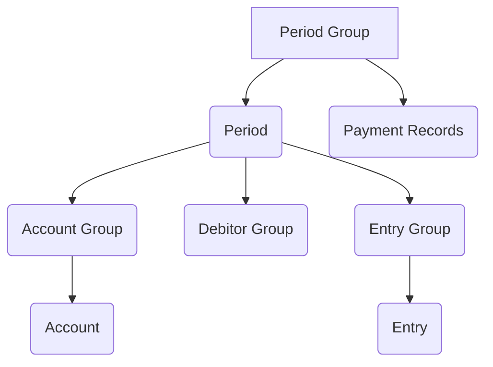
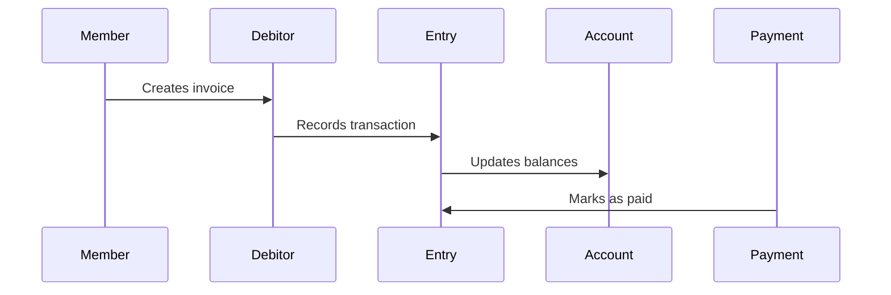
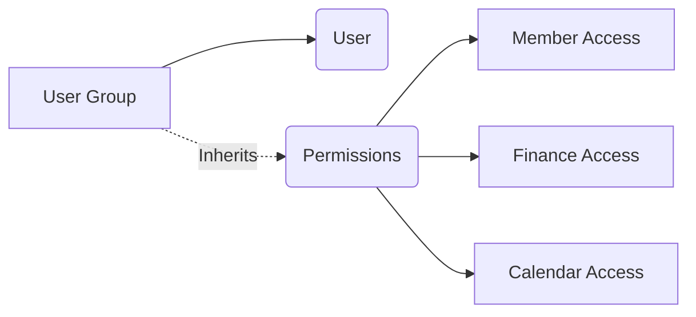
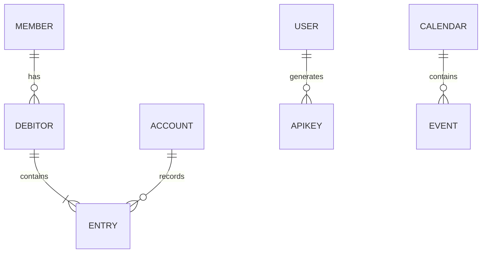

# Webling Data Structure Documentation

## Data Model Overview
Complete schema definition for Webling's database structure including members, financials, documents, and system entities. Covers all object types with their properties, relationships, and constraints.

---

## Core Object Types

### Member (`member`)
**Label Format:** `Vorname Name`

#### Properties
| Field | Type | Required | Description | Example/Values |
|-------|------|----------|-------------|----------------|
| Mitglieder-ID | AutoIncrement | No | Unique member ID | 12345 |
| Vorname | String | No | First name | "Max" |
| Name | String | No | Last name | "Muster" |
| Status | Enum | No | Membership status | Aktivmitglied, Passivmitglied |
| IBAN | String | No | Bank account number | CH9300762011623852957 |

**Categories:**
1. **Mitgliederdaten** (Basic Info):
   - Vorname, Name, Address fields, Contact info
2. **Interne Informationen** (Internal):
   - IBAN, Bemerkungen (comments)

#### Relationships
- **Parent:** Member Group (`membergroup`)
- **Linked Objects:** Comments, Emails, Debitor Records

---

### Debitor (`debitor`)
**Label Format:** `debitorid`

#### Properties
| Field | Type | Required | Description |
|-------|------|----------|-------------|
| title | LongText | No | Invoice title |
| totalamount | Number | No | Total amount due | 150.00 |
| state | Enum | No | Payment state | open/paid/partially paid |

#### Relationships
- **Parent:** Accounting Period (`period`)
- **Linked Objects:** Member, Payment Records, Accounting Entries

---

### Document (`document`)
**Label Format:** `title`

#### Properties
| Field | Type | Required | Description |
|-------|------|----------|-------------|
| file | File | No | Attached document |
| size | Integer | No | File size in bytes |
| lastmodified | Timestamp | No | Last modified date |

---

## Financial Structure

### Accounting Hierarchy


### Core Financial Objects

#### Account (`account`)
**Label:** `title`

| Property | Type | Required | Description |
|----------|------|----------|-------------|
| title | Text | No | Account name |
| amount | Numeric | No | Current balance |
| budget | Numeric | No | Allocated budget |

**Relationships:**
- Parent: Account Group (`accountgroup`)
- Links: Cost Centers, VAT Records

#### Entry (`entry`)
**Label:** `entryid`

| Property | Type | Description |
|----------|------|-------------|
| title | Text | Transaction description |
| amount | Numeric | Transaction value |
| debit | Link | Linked debit account |
| credit | Link | Linked credit account |

**Special Properties:**
- `isEBill`: Marks electronic bill payments
- `skrSphere`: Swiss accounting sphere classification

### Payment Flows


---

## System & Security

### User Management

#### User (`user`)
**Label Format:** `title`

| Property | Type | Description | Values |
|----------|------|-------------|--------|
| email | Text | Login email | |
| memberaccess | Enum | Member data access | read, read+write, none |
| financeaccess | Enum | Financial data access | read, read+write, none |
| tfaenabled | Boolean | 2FA status | true/false |

**Permissions Hierarchy:**


#### API Key (`apikey`)
**Label:** `title`

| Property | Type | Description |
|----------|------|-------------|
| administrator | Bool | Full system access |
| customaccess | Permissions | Granular access controls |
| expiration | Date | Automatic revocation date |

### Security Model
- **Role-Based Access Control** through user groups
- **Field-level security** for sensitive data (IBAN, personal data)
- **Audit trails** for financial transactions

---

## Appendix

### Comprehensive Data Types

| Type | Description | Format | Example |
|------|-------------|--------|---------|
| AutoIncrement | Unique system ID | Numeric | 123456 |
| Multienum | Multiple selections | Array | ["Vorstand", "Kassier"] |
| Permission | Granular access | JSON | `{"read": true, "write": false}` |
| Timestamp | ISO 8601 date | UTC | 2025-09-17T21:56:54Z |

### Extended Enum Values

**Member Status:**
```color-palette
Aktivmitglied: #c6f6d5 (Light Green)
Passivmitglied: #edf2f7 (Light Gray)  
Ehrenmitglied: #d6bcfa (Lavender)
Sponsor: #fbd38d (Orange)
```

**Financial States:**
| State | Color | Description |
|-------|-------|-------------|
| Open | Red | Unpaid invoice |
| Partial | Orange | Partial payment |
| Paid | Green | Completed payment |
| Writeoff | Gray | Canceled debt |

### Relationship Matrix


## Full documentation continues with all endpoints and details...
```json
{
  "account": {
    "label": [
      "title"
    ],
    "ordered": true,
    "properties": [
      {
        "id": 3,
        "datatype": "text",
        "title": "title",
        "required": false
      },
      {
        "id": 2,
        "datatype": "numeric",
        "title": "amount",
        "required": false,
        "default": 0
      },
      {
        "id": 254,
        "datatype": "numeric",
        "title": "budget",
        "required": false
      },
      {
        "id": 377,
        "datatype": "numeric",
        "title": "openingentry",
        "required": false,
        "default": 0
      }
    ],
    "children": [],
    "parents": "accountgroup",
    "links": {
      "comment": "comment",
      "accounttemplate": "accounttemplate",
      "entrygroup": "entrygroup",
      "entry": "entry",
      "vat": "vat"
    }
  },
  "accountgroup": {
    "label": [
      "title"
    ],
    "ordered": true,
    "properties": [
      {
        "id": 30,
        "datatype": "text",
        "title": "title",
        "required": false
      },
      {
        "id": 52,
        "datatype": "text",
        "title": "type",
        "required": false
      }
    ],
    "children": [
      "account"
    ],
    "parents": "period",
    "links": {
      "accountgrouptemplate": "accountgrouptemplate"
    }
  },
  "accountgrouptemplate": {
    "label": [
      "title"
    ],
    "ordered": true,
    "properties": [
      {
        "id": 325,
        "datatype": "text",
        "title": "title",
        "required": false
      },
      {
        "id": 326,
        "datatype": "text",
        "title": "type",
        "required": false
      }
    ],
    "children": [
      "accounttemplate"
    ],
    "parents": "periodchain",
    "links": {
      "accountgroup": "accountgroup"
    }
  },
  "accounttemplate": {
    "label": [
      "title"
    ],
    "ordered": true,
    "properties": [
      {
        "id": 327,
        "datatype": "text",
        "title": "title",
        "required": false
      },
      {
        "id": 472,
        "datatype": "enum",
        "title": "flag",
        "required": false,
        "values": [
          {
            "value": "debitor",
            "id": 154,
            "color": ""
          },
          {
            "value": "onlinepayment",
            "id": 155,
            "color": ""
          },
          {
            "value": "twint",
            "id": 156,
            "color": ""
          },
          {
            "value": "transitorydebitor",
            "id": 157,
            "color": ""
          },
          {
            "value": "equity",
            "id": 158,
            "color": ""
          }
        ]
      }
    ],
    "children": [],
    "parents": "accountgrouptemplate",
    "links": {
      "account": "account",
      "bankaccount": "bankaccount"
    }
  },
  "apikey": {
    "label": [
      "title"
    ],
    "ordered": false,
    "properties": [
      {
        "id": 240,
        "datatype": "text",
        "title": "title",
        "required": false,
        "default": ""
      },
      {
        "id": 242,
        "datatype": "bool",
        "title": "administrator",
        "required": false
      },
      {
        "id": -10,
        "datatype": "permissions",
        "title": "custommemberaccess",
        "required": false
      },
      {
        "id": -11,
        "datatype": "permissions",
        "title": "customfinanceaccess",
        "required": false
      },
      {
        "id": -31,
        "datatype": "permissions",
        "title": "customcalendaraccess",
        "required": false
      },
      {
        "id": 243,
        "datatype": "enum",
        "title": "memberaccess",
        "required": false,
        "default": "custom",
        "values": [
          {
            "value": "read",
            "id": 53,
            "color": ""
          },
          {
            "value": "read+write",
            "id": 54,
            "color": ""
          },
          {
            "value": "custom",
            "id": 55,
            "color": ""
          }
        ]
      },
      {
        "id": 244,
        "datatype": "enum",
        "title": "financeaccess",
        "required": false,
        "default": "custom",
        "values": [
          {
            "value": "read",
            "id": 56,
            "color": ""
          },
          {
            "value": "read+write",
            "id": 57,
            "color": ""
          },
          {
            "value": "custom",
            "id": 58,
            "color": ""
          }
        ]
      },
      {
        "id": 471,
        "datatype": "enum",
        "title": "calendaraccess",
        "required": false,
        "default": "custom",
        "values": [
          {
            "value": "read",
            "id": 151,
            "color": ""
          },
          {
            "value": "read+write",
            "id": 152,
            "color": ""
          },
          {
            "value": "custom",
            "id": 153,
            "color": ""
          }
        ]
      },
      {
        "id": 245,
        "datatype": "enum",
        "title": "articleaccess",
        "required": false,
        "default": "none",
        "values": [
          {
            "value": "read+write",
            "id": 59,
            "color": ""
          },
          {
            "value": "none",
            "id": 60,
            "color": ""
          }
        ]
      }
    ],
    "children": [],
    "parents": null,
    "links": {}
  },
  "article": {
    "label": [
      "title"
    ],
    "ordered": false,
    "properties": [
      {
        "id": 58,
        "datatype": "text",
        "title": "title",
        "required": false
      },
      {
        "id": 57,
        "datatype": "longtext",
        "title": "description",
        "required": false
      },
      {
        "id": 59,
        "datatype": "text",
        "title": "place",
        "required": false
      },
      {
        "id": 60,
        "datatype": "numeric",
        "title": "price",
        "required": false
      },
      {
        "id": 61,
        "datatype": "int",
        "title": "quantity",
        "required": false,
        "min": "-inf"
      }
    ],
    "children": [],
    "parents": "articlegroup",
    "links": {}
  },
  "articlegroup": {
    "label": [
      "title"
    ],
    "ordered": false,
    "properties": [
      {
        "id": 56,
        "datatype": "text",
        "title": "title",
        "required": false
      }
    ],
    "children": [
      "article"
    ],
    "parents": null,
    "links": {}
  },
  "attendee": {
    "label": [
      "state"
    ],
    "ordered": false,
    "properties": [
      {
        "id": 332,
        "datatype": "enum",
        "title": "state",
        "required": false,
        "values": [
          {
            "value": "attended",
            "id": 116,
            "color": ""
          }
        ]
      }
    ],
    "children": [],
    "parents": "presencelist",
    "links": {
      "member": "member"
    }
  },
  "bankaccount": {
    "label": [
      "title"
    ],
    "ordered": false,
    "properties": [
      {
        "id": 518,
        "datatype": "text",
        "title": "title",
        "required": false
      },
      {
        "id": 519,
        "datatype": "numeric",
        "title": "balance",
        "required": false
      },
      {
        "id": 520,
        "datatype": "text",
        "title": "iban",
        "required": false
      },
      {
        "id": 521,
        "datatype": "timestamp",
        "title": "lastSync",
        "required": false
      },
      {
        "id": 522,
        "datatype": "enum",
        "title": "accounttype",
        "required": false,
        "default": "offlineAccount",
        "values": [
          {
            "value": "onlineAccount",
            "id": 191,
            "color": ""
          },
          {
            "value": "offlineAccount",
            "id": 192,
            "color": ""
          }
        ]
      },
      {
        "id": 523,
        "datatype": "text",
        "title": "iconUrl",
        "required": false
      },
      {
        "id": 524,
        "datatype": "text",
        "title": "externalId",
        "required": false
      },
      {
        "id": 525,
        "datatype": "longtext",
        "title": "data",
        "required": false
      }
    ],
    "children": [],
    "parents": "periodchain",
    "links": {
      "accounttemplate": "accounttemplate",
      "payment": "payment",
      "saltedgeconnection": "saltedgeconnection"
    }
  },
  "calendar": {
    "label": [
      "title"
    ],
    "ordered": false,
    "properties": [
      {
        "id": 451,
        "datatype": "text",
        "title": "title",
        "required": false
      },
      {
        "id": 452,
        "datatype": "text",
        "title": "color",
        "required": false
      },
      {
        "id": 453,
        "datatype": "bool",
        "title": "isPublic",
        "required": false
      },
      {
        "id": 454,
        "datatype": "text",
        "title": "publicHash",
        "required": false
      },
      {
        "id": 455,
        "datatype": "text",
        "title": "icsHash",
        "required": false
      }
    ],
    "children": [
      "calendarevent"
    ],
    "parents": null,
    "links": {
      "membergroup": "membergroup"
    }
  },
  "calendarevent": {
    "label": [
      "title"
    ],
    "ordered": false,
    "properties": [
      {
        "id": 456,
        "datatype": "text",
        "title": "title",
        "required": false
      },
      {
        "id": 457,
        "datatype": "longtext",
        "title": "description",
        "required": false
      },
      {
        "id": 458,
        "datatype": "text",
        "title": "place",
        "required": false
      },
      {
        "id": 459,
        "datatype": "timestamp",
        "title": "begin",
        "required": false
      },
      {
        "id": 460,
        "datatype": "timestamp",
        "title": "end",
        "required": false
      },
      {
        "id": 461,
        "datatype": "int",
        "title": "duration",
        "required": false,
        "min": "-inf"
      },
      {
        "id": 462,
        "datatype": "bool",
        "title": "isAllDay",
        "required": false
      },
      {
        "id": 463,
        "datatype": "bool",
        "title": "isRecurring",
        "required": false
      },
      {
        "id": 464,
        "datatype": "enum",
        "title": "status",
        "required": false,
        "default": "confirmed",
        "values": [
          {
            "value": "confirmed",
            "id": 144,
            "color": ""
          },
          {
            "value": "canceled",
            "id": 145,
            "color": ""
          }
        ]
      },
      {
        "id": 465,
        "datatype": "text",
        "title": "recurrencePattern",
        "required": false
      },
      {
        "id": 466,
        "datatype": "bool",
        "title": "enableParticipantSignup",
        "required": false
      },
      {
        "id": 481,
        "datatype": "bool",
        "title": "enableParticipantMaybeState",
        "required": false
      },
      {
        "id": 485,
        "datatype": "bool",
        "title": "isSignupBinding",
        "required": false
      },
      {
        "id": 467,
        "datatype": "int",
        "title": "maxParticipants",
        "required": false,
        "min": "-inf"
      },
      {
        "id": -32,
        "datatype": "int",
        "title": "signedupParticipants",
        "required": false
      },
      {
        "id": 480,
        "datatype": "timestamp",
        "title": "signupAllowedUntil",
        "required": false
      },
      {
        "id": 468,
        "datatype": "bool",
        "title": "doAutoAcceptParticipants",
        "required": false
      },
      {
        "id": 469,
        "datatype": "longtext",
        "title": "questionSchema",
        "required": false
      },
      {
        "id": 479,
        "datatype": "bool",
        "title": "showParticipationsInPortal",
        "required": false
      },
      {
        "id": 492,
        "datatype": "bool",
        "title": "showAllAnswersInPortal",
        "required": false
      }
    ],
    "children": [
      "participant"
    ],
    "parents": "calendar",
    "links": {
      "presencelist": "presencelist",
      "file": "file"
    }
  },
  "comment": {
    "label": [
      "text"
    ],
    "ordered": true,
    "properties": [
      {
        "id": 308,
        "datatype": "longtext",
        "title": "text",
        "required": false
      }
    ],
    "children": [],
    "parents": null,
    "links": {
      "member": "member",
      "debitor": "debitor",
      "user": "user",
      "account": "account"
    }
  },
  "costcenter": {
    "label": [
      "title"
    ],
    "ordered": false,
    "properties": [
      {
        "id": 151,
        "datatype": "text",
        "title": "title",
        "required": false
      }
    ],
    "children": [],
    "parents": "period",
    "links": {
      "entry": "entry"
    }
  },
  "debitor": {
    "label": [
      "debitorid"
    ],
    "ordered": false,
    "properties": [
      {
        "id": 379,
        "datatype": "longtext",
        "title": "title",
        "required": false
      },
      {
        "id": 7,
        "datatype": "longtext",
        "title": "comment",
        "required": false
      },
      {
        "id": 434,
        "datatype": "date",
        "title": "date",
        "required": false
      },
      {
        "id": 378,
        "datatype": "longtext",
        "title": "invoiceitems",
        "required": false
      },
      {
        "id": 6,
        "datatype": "longtext",
        "title": "address",
        "required": false
      },
      {
        "id": 271,
        "datatype": "numeric",
        "title": "remainingamount",
        "required": false,
        "default": 0
      },
      {
        "id": 374,
        "datatype": "numeric",
        "title": "totalamount",
        "required": false,
        "default": 0
      },
      {
        "id": 375,
        "datatype": "numeric",
        "title": "paidamount",
        "required": false,
        "default": 0
      },
      {
        "id": 376,
        "datatype": "numeric",
        "title": "writeoffamount",
        "required": false,
        "default": 0
      },
      {
        "id": 8,
        "datatype": "date",
        "title": "duedate",
        "required": false
      },
      {
        "id": 21,
        "datatype": "autoincrement",
        "title": "debitorid",
        "required": false
      },
      {
        "id": 22,
        "datatype": "enum",
        "title": "state",
        "required": false,
        "default": "open",
        "values": [
          {
            "value": "open",
            "id": 8,
            "color": ""
          },
          {
            "value": "paid",
            "id": 10,
            "color": ""
          },
          {
            "value": "partially paid",
            "id": 12,
            "color": ""
          },
          {
            "value": "writeoff",
            "id": 125,
            "color": ""
          }
        ]
      }
    ],
    "children": [],
    "parents": "period",
    "links": {
      "member": "member",
      "email": "email",
      "emailsent": "emailsent",
      "letter": "letter",
      "letterpdf": "letterpdf",
      "comment": "comment",
      "debitorcategory": "debitorcategory",
      "paymentrecord": "payment",
      "revenue": "entry",
      "payment": "entry",
      "writeoff": "entry",
      "entry": "entry"
    }
  },
  "debitorcategory": {
    "label": [
      "title"
    ],
    "ordered": false,
    "properties": [
      {
        "id": 50,
        "datatype": "text",
        "title": "title",
        "required": false
      }
    ],
    "children": [],
    "parents": "periodgroup",
    "links": {
      "debitor": "debitor"
    }
  },
  "document": {
    "label": [
      "title"
    ],
    "ordered": false,
    "properties": [
      {
        "id": 98,
        "datatype": "longtext",
        "title": "description",
        "required": false,
        "default": ""
      },
      {
        "id": 106,
        "datatype": "bool",
        "title": "isProtected",
        "required": false
      },
      {
        "id": -5,
        "datatype": "text",
        "title": "protectedBy",
        "required": false
      },
      {
        "id": 100,
        "datatype": "file",
        "title": "file",
        "required": false
      },
      {
        "id": 101,
        "datatype": "int",
        "title": "size",
        "required": false
      },
      {
        "id": 102,
        "datatype": "timestamp",
        "title": "lastmodified",
        "required": false
      },
      {
        "id": -2,
        "datatype": "text",
        "title": "href",
        "required": false
      },
      {
        "id": -1,
        "datatype": "text",
        "title": "title",
        "required": false,
        "default": "file"
      }
    ],
    "children": [],
    "parents": "documentgroup",
    "links": {}
  },
  "documentgroup": {
    "label": [
      "title"
    ],
    "ordered": false,
    "properties": [
      {
        "id": 108,
        "datatype": "text",
        "title": "title",
        "required": false
      }
    ],
    "children": [
      "document",
      "documentgroup"
    ],
    "parents": "documentgroup",
    "links": {
      "usergroup": "usergroup",
      "user": "user",
      "page": "page"
    }
  },
  "domain": {
    "label": [
      "title"
    ],
    "ordered": false,
    "properties": [
      {
        "id": 255,
        "datatype": "text",
        "title": "title",
        "required": false,
        "default": ""
      },
      {
        "id": 256,
        "datatype": "bool",
        "title": "emailverified",
        "required": false
      }
    ],
    "children": [],
    "parents": null,
    "links": {}
  },
  "email": {
    "label": [
      "subject"
    ],
    "ordered": false,
    "properties": [
      {
        "id": 507,
        "datatype": "text",
        "title": "title",
        "required": false
      },
      {
        "id": 171,
        "datatype": "text",
        "title": "subject",
        "required": false
      },
      {
        "id": 173,
        "datatype": "longtext",
        "title": "body",
        "required": false
      },
      {
        "id": 232,
        "datatype": "longtext",
        "title": "paperletter",
        "required": false
      },
      {
        "id": 164,
        "datatype": "text",
        "title": "fromName",
        "required": false
      },
      {
        "id": 508,
        "datatype": "text",
        "title": "fromEmail",
        "required": false
      },
      {
        "id": 165,
        "datatype": "longtext",
        "title": "to",
        "required": false
      },
      {
        "id": 166,
        "datatype": "longtext",
        "title": "cc",
        "required": false
      },
      {
        "id": 167,
        "datatype": "longtext",
        "title": "bcc",
        "required": false
      },
      {
        "id": 505,
        "datatype": "enum",
        "title": "emailtype",
        "required": false,
        "default": "member",
        "values": [
          {
            "value": "member",
            "id": 185,
            "color": ""
          },
          {
            "value": "debitor",
            "id": 186,
            "color": ""
          }
        ]
      },
      {
        "id": 504,
        "datatype": "enum",
        "title": "state",
        "required": false,
        "default": "draft",
        "values": [
          {
            "value": "draft",
            "id": 182,
            "color": ""
          },
          {
            "value": "template",
            "id": 183,
            "color": ""
          },
          {
            "value": "sent",
            "id": 184,
            "color": ""
          }
        ]
      },
      {
        "id": 169,
        "datatype": "timestamp",
        "title": "sentat",
        "required": false
      },
      {
        "id": 509,
        "datatype": "text",
        "title": "sentby",
        "required": false
      },
      {
        "id": 170,
        "datatype": "longtext",
        "title": "data",
        "required": false
      },
      {
        "id": 503,
        "datatype": "bool",
        "title": "isPrivate",
        "required": false
      },
      {
        "id": 210,
        "datatype": "bool",
        "title": "isJoined",
        "required": false
      },
      {
        "id": 168,
        "datatype": "longtext",
        "title": "emailFields",
        "required": false
      },
      {
        "id": 211,
        "datatype": "text",
        "title": "senderField",
        "required": false
      },
      {
        "id": 506,
        "datatype": "int",
        "title": "receiptCount",
        "required": false,
        "min": "-inf"
      },
      {
        "id": 494,
        "datatype": "image",
        "title": "preview",
        "required": false
      }
    ],
    "children": [
      "emailattachment",
      "emailimage",
      "emailsent"
    ],
    "parents": null,
    "links": {
      "sender": "user",
      "owners": "user",
      "member": "member",
      "debitor": "debitor",
      "letter": "letter",
      "rnwform": "rnwform"
    }
  },
  "emailattachment": {
    "label": [
      "title"
    ],
    "ordered": false,
    "properties": [
      {
        "id": 175,
        "datatype": "file",
        "title": "file",
        "required": false
      },
      {
        "id": -18,
        "datatype": "text",
        "title": "title",
        "required": false
      }
    ],
    "children": [],
    "parents": "email",
    "links": {}
  },
  "emailimage": {
    "label": [
      "title"
    ],
    "ordered": false,
    "properties": [
      {
        "id": 502,
        "datatype": "text",
        "title": "title",
        "required": false
      },
      {
        "id": 183,
        "datatype": "image",
        "title": "image",
        "required": false
      }
    ],
    "children": [],
    "parents": "email",
    "links": {}
  },
  "emailsent": {
    "label": [
      "subject"
    ],
    "ordered": false,
    "properties": [
      {
        "id": 510,
        "datatype": "text",
        "title": "subject",
        "required": false
      },
      {
        "id": 511,
        "datatype": "text",
        "title": "to",
        "required": false
      },
      {
        "id": 512,
        "datatype": "longtext",
        "title": "placeholders",
        "required": false
      }
    ],
    "children": [],
    "parents": "email",
    "links": {
      "member": "member",
      "debitor": "debitor",
      "letterpdf": "letterpdf"
    }
  },
  "emotion": {
    "label": [
      "emotion"
    ],
    "ordered": false,
    "properties": [
      {
        "id": 422,
        "datatype": "enum",
        "title": "emotion",
        "required": false,
        "default": "like",
        "values": [
          {
            "value": "like",
            "id": 130,
            "color": ""
          }
        ]
      },
      {
        "id": -24,
        "datatype": "text",
        "title": "memberlabel",
        "required": false
      },
      {
        "id": -25,
        "datatype": "image",
        "title": "memberimage",
        "required": false
      }
    ],
    "children": [],
    "parents": "post",
    "links": {
      "member": "member"
    }
  },
  "entry": {
    "label": [
      "entryid"
    ],
    "ordered": false,
    "properties": [
      {
        "id": 26,
        "datatype": "text",
        "title": "title",
        "required": false
      },
      {
        "id": 28,
        "datatype": "text",
        "title": "receipt",
        "required": false
      },
      {
        "id": 23,
        "datatype": "numeric",
        "title": "amount",
        "required": false
      },
      {
        "id": 257,
        "datatype": "int",
        "title": "entryid",
        "required": false,
        "min": "-inf"
      },
      {
        "id": 489,
        "datatype": "int",
        "title": "skrSphere",
        "required": false,
        "min": "-inf"
      },
      {
        "id": 258,
        "datatype": "binary",
        "title": "receiptfile",
        "required": false
      },
      {
        "id": 532,
        "datatype": "bool",
        "title": "isEBill",
        "required": false
      }
    ],
    "children": [],
    "parents": "entrygroup",
    "links": {
      "debit": "account",
      "credit": "account",
      "account": "account",
      "costcenter": "costcenter",
      "debitor": "debitor",
      "payment": "payment",
      "vat": "vat",
      "entry": "entry"
    }
  },
  "entrygroup": {
    "label": [
      "title"
    ],
    "ordered": false,
    "properties": [
      {
        "id": 264,
        "datatype": "text",
        "title": "title",
        "required": false
      },
      {
        "id": 265,
        "datatype": "date",
        "title": "date",
        "required": false
      }
    ],
    "children": [
      "entry"
    ],
    "parents": "period",
    "links": {
      "account": "account"
    }
  },
  "file": {
    "label": [
      "title"
    ],
    "ordered": false,
    "properties": [
      {
        "id": 441,
        "datatype": "text",
        "title": "title",
        "required": false
      },
      {
        "id": 442,
        "datatype": "binary",
        "title": "file",
        "required": false
      },
      {
        "id": 488,
        "datatype": "text",
        "title": "publicHash",
        "required": false,
        "default": ""
      },
      {
        "id": 483,
        "datatype": "enum",
        "title": "state",
        "required": false,
        "default": "ready",
        "values": [
          {
            "value": "pending",
            "id": 170,
            "color": ""
          },
          {
            "value": "ready",
            "id": 171,
            "color": ""
          },
          {
            "value": "expired",
            "id": 172,
            "color": ""
          }
        ]
      },
      {
        "id": 484,
        "datatype": "timestamp",
        "title": "expiresAt",
        "required": false
      }
    ],
    "children": [],
    "parents": null,
    "links": {
      "page": "page",
      "letter": "letter",
      "calendarevent": "calendarevent",
      "memberform": "memberform"
    }
  },
  "letter": {
    "label": [
      "title"
    ],
    "ordered": false,
    "properties": [
      {
        "id": 333,
        "datatype": "text",
        "title": "title",
        "required": false
      },
      {
        "id": 369,
        "datatype": "enum",
        "title": "lettertype",
        "required": false,
        "default": "member",
        "values": [
          {
            "value": "member",
            "id": 121,
            "color": ""
          },
          {
            "value": "debitor",
            "id": 122,
            "color": ""
          }
        ]
      },
      {
        "id": 334,
        "datatype": "enum",
        "title": "state",
        "required": false,
        "default": "draft",
        "values": [
          {
            "value": "draft",
            "id": 117,
            "color": ""
          },
          {
            "value": "template",
            "id": 118,
            "color": ""
          },
          {
            "value": "sent",
            "id": 119,
            "color": ""
          }
        ]
      },
      {
        "id": 335,
        "datatype": "timestamp",
        "title": "sentat",
        "required": false
      },
      {
        "id": 336,
        "datatype": "text",
        "title": "sentby",
        "required": false
      },
      {
        "id": 337,
        "datatype": "longtext",
        "title": "data",
        "required": false
      },
      {
        "id": 370,
        "datatype": "bool",
        "title": "isattachment",
        "required": false
      },
      {
        "id": 338,
        "datatype": "image",
        "title": "preview",
        "required": false
      }
    ],
    "children": [
      "letterimage",
      "letterpdf"
    ],
    "parents": null,
    "links": {
      "member": "member",
      "debitor": "debitor",
      "sender": "user",
      "owners": "user",
      "email": "email",
      "file": "file"
    }
  },
  "letterimage": {
    "label": [
      "title"
    ],
    "ordered": false,
    "properties": [
      {
        "id": 346,
        "datatype": "text",
        "title": "title",
        "required": false
      },
      {
        "id": 347,
        "datatype": "image",
        "title": "image",
        "required": false
      }
    ],
    "children": [],
    "parents": "letter",
    "links": {}
  },
  "letterpdf": {
    "label": [
      "pdf"
    ],
    "ordered": false,
    "properties": [
      {
        "id": 355,
        "datatype": "file",
        "title": "pdf",
        "required": false
      }
    ],
    "children": [],
    "parents": "letter",
    "links": {
      "member": "member",
      "debitor": "debitor",
      "emailsent": "emailsent"
    }
  },
  "member": {
    "label": [
      "Vorname",
      "Name"
    ],
    "ordered": false,
    "properties": [
      {
        "id": 309,
        "datatype": "autoincrement",
        "title": "Mitglieder-ID",
        "required": false
      },
      {
        "id": 83,
        "datatype": "text",
        "title": "Vorname",
        "required": false,
        "type": "firstname"
      },
      {
        "id": 75,
        "datatype": "text",
        "title": "Name",
        "required": false,
        "type": "lastname"
      },
      {
        "id": 79,
        "datatype": "text",
        "title": "Strasse",
        "required": false,
        "type": "address"
      },
      {
        "id": 77,
        "datatype": "text",
        "title": "PLZ",
        "required": false,
        "type": "plz"
      },
      {
        "id": 76,
        "datatype": "text",
        "title": "Ort",
        "required": false,
        "type": "city"
      },
      {
        "id": 80,
        "datatype": "text",
        "title": "Telefon",
        "required": false,
        "type": "phone"
      },
      {
        "id": 73,
        "datatype": "text",
        "title": "Mobile",
        "required": false,
        "type": "mobile"
      },
      {
        "id": 67,
        "datatype": "text",
        "title": "E-Mail",
        "required": false,
        "type": "email"
      },
      {
        "id": 71,
        "datatype": "enum",
        "title": "Lizenz",
        "required": false,
        "values": [
          {
            "value": "1.Liga",
            "color": "",
            "id": 22
          },
          {
            "value": "2.Liga",
            "color": "",
            "id": 23
          },
          {
            "value": "Junior",
            "color": "",
            "id": 24
          }
        ]
      },
      {
        "id": 69,
        "datatype": "enum",
        "title": "Geschlecht",
        "required": false,
        "values": [
          {
            "value": "w",
            "color": "",
            "id": 20
          },
          {
            "value": "m",
            "color": "",
            "id": 21
          }
        ]
      },
      {
        "id": 68,
        "datatype": "date",
        "title": "Geburtstag",
        "required": false,
        "type": "birthday"
      },
      {
        "id": 72,
        "datatype": "image",
        "title": "Mitgliederbild",
        "required": false,
        "type": "userimage"
      },
      {
        "id": 312,
        "datatype": "enum",
        "title": "Status",
        "required": false,
        "values": [
          {
            "value": "Aktivmitglied",
            "color": "#c6f6d5",
            "id": 92
          },
          {
            "value": "Passivmitglied",
            "color": "#edf2f7",
            "id": 93
          },
          {
            "value": "Gönner",
            "color": "#bee3f8",
            "id": 94
          },
          {
            "value": "Ehrenmitglied",
            "color": "#d6bcfa",
            "id": 95
          },
          {
            "value": "Sponsor",
            "color": "#fbd38d",
            "id": 96
          },
          {
            "value": "Ausgetreten",
            "color": "#feb2b2",
            "id": 97
          }
        ]
      },
      {
        "id": 313,
        "datatype": "multienum",
        "title": "Funktion",
        "required": false,
        "values": [
          {
            "value": "Vorstand",
            "color": "",
            "id": 98
          },
          {
            "value": "Kassier",
            "color": "",
            "id": 99
          },
          {
            "value": "Präsident",
            "color": "",
            "id": 100
          },
          {
            "value": "Aktuar",
            "color": "",
            "id": 101
          },
          {
            "value": "Revisor",
            "color": "",
            "id": 102
          },
          {
            "value": "Trainer",
            "color": "",
            "id": 103
          },
          {
            "value": "Beisitzer",
            "color": "",
            "id": 104
          }
        ]
      },
      {
        "id": 310,
        "datatype": "text",
        "title": "IBAN",
        "required": false,
        "type": "iban"
      },
      {
        "id": 311,
        "datatype": "longtext",
        "title": "Bemerkungen",
        "required": false
      }
    ],
    "children": [],
    "parents": "membergroup",
    "links": {
      "comment": "comment",
      "email": "email",
      "debitor": "debitor",
      "emailsent": "emailsent",
      "letter": "letter",
      "letterpdf": "letterpdf",
      "attendee": "attendee",
      "participant": "participant",
      "postcomment": "postcomment",
      "emotion": "emotion"
    },
    "categories": [
      {
        "id": 1,
        "title": "Mitgliederdaten",
        "readonly": false,
        "properties": [
          309,
          83,
          75,
          79,
          77,
          76,
          80,
          73,
          67,
          71,
          69,
          68,
          72,
          312,
          313
        ],
        "access": null
      },
      {
        "id": 2,
        "title": "Interne Informationen",
        "readonly": false,
        "properties": [
          310,
          311
        ],
        "access": {}
      }
    ]
  },
  "memberform": {
    "label": [
      "title"
    ],
    "ordered": false,
    "properties": [
      {
        "id": 361,
        "datatype": "text",
        "title": "title",
        "required": false
      },
      {
        "id": 362,
        "datatype": "text",
        "title": "hash",
        "required": false
      },
      {
        "id": 363,
        "datatype": "longtext",
        "title": "fields",
        "required": false
      },
      {
        "id": 364,
        "datatype": "text",
        "title": "notificationEmail",
        "required": false
      },
      {
        "id": 365,
        "datatype": "longtext",
        "title": "confirmationHtml",
        "required": false
      },
      {
        "id": 366,
        "datatype": "text",
        "title": "submitButtonText",
        "required": false
      },
      {
        "id": 367,
        "datatype": "int",
        "title": "maxSignups",
        "required": false,
        "min": "-inf"
      },
      {
        "id": 368,
        "datatype": "longtext",
        "title": "maxSignupsText",
        "required": false
      },
      {
        "id": 382,
        "datatype": "bool",
        "title": "confirmationEmailEnabled",
        "required": false
      },
      {
        "id": 383,
        "datatype": "int",
        "title": "confirmationEmailField",
        "required": false,
        "min": "-inf"
      },
      {
        "id": 384,
        "datatype": "text",
        "title": "confirmationEmailReplyto",
        "required": false
      },
      {
        "id": 385,
        "datatype": "text",
        "title": "confirmationEmailSubject",
        "required": false
      },
      {
        "id": 386,
        "datatype": "longtext",
        "title": "confirmationEmailText",
        "required": false
      },
      {
        "id": 387,
        "datatype": "longtext",
        "title": "descriptionHtml",
        "required": false
      },
      {
        "id": 407,
        "datatype": "bool",
        "title": "privacyCheckboxEnabled",
        "required": false
      },
      {
        "id": 408,
        "datatype": "longtext",
        "title": "privacyCheckboxHtml",
        "required": false
      },
      {
        "id": 433,
        "datatype": "text",
        "title": "color",
        "required": false
      }
    ],
    "children": [],
    "parents": "membergroup",
    "links": {
      "file": "file"
    }
  },
  "membergroup": {
    "label": [
      "title"
    ],
    "ordered": true,
    "properties": [
      {
        "id": 85,
        "datatype": "text",
        "title": "title",
        "required": false
      },
      {
        "id": 487,
        "datatype": "int",
        "title": "position",
        "required": false,
        "default": 0,
        "min": "-inf"
      }
    ],
    "children": [
      "membergroup",
      "member",
      "memberform"
    ],
    "parents": "membergroup",
    "links": {
      "presencelist": "presencelist",
      "calendar": "calendar",
      "page": "page"
    }
  },
  "page": {
    "label": [
      "title"
    ],
    "ordered": false,
    "properties": [
      {
        "id": 438,
        "datatype": "text",
        "title": "title",
        "required": false
      },
      {
        "id": 439,
        "datatype": "longtext",
        "title": "content",
        "required": false
      },
      {
        "id": 448,
        "datatype": "enum",
        "title": "pageType",
        "required": false,
        "default": "page",
        "values": [
          {
            "value": "page",
            "id": 137,
            "color": ""
          },
          {
            "value": "memberList",
            "id": 138,
            "color": ""
          },
          {
            "value": "link",
            "id": 139,
            "color": ""
          },
          {
            "value": "iframe",
            "id": 140,
            "color": ""
          },
          {
            "value": "documentgroup",
            "id": 165,
            "color": ""
          },
          {
            "value": "eventfrog",
            "id": 195,
            "color": ""
          },
          {
            "value": "birthdays",
            "id": 196,
            "color": ""
          }
        ]
      },
      {
        "id": 449,
        "datatype": "longtext",
        "title": "memberListConfig",
        "required": false
      },
      {
        "id": 533,
        "datatype": "longtext",
        "title": "config",
        "required": false
      },
      {
        "id": 450,
        "datatype": "text",
        "title": "linkUrl",
        "required": false
      },
      {
        "id": 440,
        "datatype": "int",
        "title": "position",
        "required": false,
        "default": 0,
        "min": "-inf"
      }
    ],
    "children": [
      "page"
    ],
    "parents": "page",
    "links": {
      "file": "file",
      "documentgroup": "documentgroup",
      "membergroup": "membergroup"
    }
  },
  "participant": {
    "label": [
      "state"
    ],
    "ordered": false,
    "properties": [
      {
        "id": 475,
        "datatype": "enum",
        "title": "state",
        "required": false,
        "default": "invited",
        "values": [
          {
            "value": "invited",
            "id": 159,
            "color": ""
          },
          {
            "value": "applied",
            "id": 160,
            "color": ""
          },
          {
            "value": "confirmed",
            "id": 161,
            "color": ""
          },
          {
            "value": "rejected",
            "id": 162,
            "color": ""
          },
          {
            "value": "maybe",
            "id": 163,
            "color": ""
          }
        ]
      },
      {
        "id": 476,
        "datatype": "bool",
        "title": "accepted",
        "required": false
      },
      {
        "id": 477,
        "datatype": "timestamp",
        "title": "acceptedAt",
        "required": false
      },
      {
        "id": 478,
        "datatype": "timestamp",
        "title": "invitedAt",
        "required": false
      },
      {
        "id": 474,
        "datatype": "longtext",
        "title": "questions",
        "required": false
      },
      {
        "id": -28,
        "datatype": "text",
        "title": "memberlabel",
        "required": false
      },
      {
        "id": -29,
        "datatype": "image",
        "title": "memberimage",
        "required": false
      }
    ],
    "children": [],
    "parents": "calendarevent",
    "links": {
      "member": "member"
    }
  },
  "payment": {
    "label": [
      "title"
    ],
    "ordered": true,
    "properties": [
      {
        "id": 409,
        "datatype": "text",
        "title": "title",
        "required": false
      },
      {
        "id": 517,
        "datatype": "bool",
        "title": "ignored",
        "required": false
      },
      {
        "id": 297,
        "datatype": "text",
        "title": "transactionid",
        "required": false
      },
      {
        "id": 298,
        "datatype": "int",
        "title": "referenceid",
        "required": false,
        "min": "-inf"
      },
      {
        "id": 299,
        "datatype": "enum",
        "title": "paymenttype",
        "required": false,
        "values": [
          {
            "value": "camt",
            "id": 83,
            "color": ""
          },
          {
            "value": "rnw",
            "id": 84,
            "color": ""
          },
          {
            "value": "rnwhub",
            "id": 127,
            "color": ""
          },
          {
            "value": "saltedge",
            "id": 190,
            "color": ""
          }
        ]
      },
      {
        "id": 410,
        "datatype": "text",
        "title": "customername",
        "required": false
      },
      {
        "id": 300,
        "datatype": "date",
        "title": "date",
        "required": false
      },
      {
        "id": 304,
        "datatype": "numeric",
        "title": "amount",
        "required": false
      },
      {
        "id": 305,
        "datatype": "longtext",
        "title": "data",
        "required": false
      },
      {
        "id": 306,
        "datatype": "text",
        "title": "status",
        "required": false
      },
      {
        "id": 307,
        "datatype": "enum",
        "title": "processed",
        "required": false,
        "values": [
          {
            "value": "new",
            "id": 85,
            "color": ""
          },
          {
            "value": "processed",
            "id": 86,
            "color": ""
          },
          {
            "value": "partial",
            "id": 193,
            "color": ""
          },
          {
            "value": "removed",
            "id": 87,
            "color": ""
          }
        ]
      }
    ],
    "children": [],
    "parents": "periodgroup",
    "links": {
      "debitor": "debitor",
      "entry": "entry",
      "rnwform": "rnwform",
      "bankaccount": "bankaccount"
    }
  },
  "period": {
    "label": [
      "title"
    ],
    "ordered": false,
    "properties": [
      {
        "id": 39,
        "datatype": "text",
        "title": "title",
        "required": false
      },
      {
        "id": 321,
        "datatype": "longtext",
        "title": "budgetdescription",
        "required": false
      },
      {
        "id": 40,
        "datatype": "date",
        "title": "from",
        "required": false
      },
      {
        "id": 45,
        "datatype": "date",
        "title": "to",
        "required": false
      },
      {
        "id": 44,
        "datatype": "enum",
        "title": "state",
        "required": false,
        "default": "open",
        "values": [
          {
            "value": "open",
            "id": 13,
            "color": ""
          },
          {
            "value": "closed",
            "id": 14,
            "color": ""
          }
        ]
      },
      {
        "id": 490,
        "datatype": "bool",
        "title": "hasSpheres",
        "required": false
      }
    ],
    "children": [
      "debitor",
      "entrygroup",
      "accountgroup",
      "costcenter",
      "vat"
    ],
    "parents": "periodgroup",
    "links": {
      "periodchain": "periodchain"
    }
  },
  "periodchain": {
    "label": [
      "title"
    ],
    "ordered": false,
    "properties": [
      {
        "id": 322,
        "datatype": "text",
        "title": "title",
        "required": false
      },
      {
        "id": 323,
        "datatype": "enum",
        "title": "sourcechart",
        "required": false,
        "values": [
          {
            "value": "simple",
            "id": 108,
            "color": ""
          },
          {
            "value": "deSkr49",
            "id": 109,
            "color": ""
          },
          {
            "value": "deSkr42",
            "id": 178,
            "color": ""
          },
          {
            "value": "chKmuSimple",
            "id": 110,
            "color": ""
          },
          {
            "value": "deDsb",
            "id": 129,
            "color": ""
          },
          {
            "value": "custom",
            "id": 111,
            "color": ""
          }
        ]
      }
    ],
    "children": [
      "accountgrouptemplate",
      "bankaccount",
      "saltedgeconnection"
    ],
    "parents": "periodgroup",
    "links": {
      "period": "period"
    }
  },
  "periodgroup": {
    "label": [
      "title"
    ],
    "ordered": false,
    "properties": [
      {
        "id": 153,
        "datatype": "text",
        "title": "title",
        "required": false
      }
    ],
    "children": [
      "period",
      "rnwmerchant",
      "payment",
      "periodchain",
      "debitorcategory"
    ],
    "parents": null,
    "links": {}
  },
  "post": {
    "label": [
      "title"
    ],
    "ordered": false,
    "properties": [
      {
        "id": 411,
        "datatype": "text",
        "title": "title",
        "required": false
      },
      {
        "id": 412,
        "datatype": "longtext",
        "title": "text",
        "required": false
      },
      {
        "id": 413,
        "datatype": "image",
        "title": "image",
        "required": false
      },
      {
        "id": -26,
        "datatype": "text",
        "title": "userlabel",
        "required": false
      },
      {
        "id": -27,
        "datatype": "image",
        "title": "avatar",
        "required": false
      }
    ],
    "children": [
      "postcomment",
      "emotion"
    ],
    "parents": null,
    "links": {
      "user": "user"
    }
  },
  "postcomment": {
    "label": [
      "text"
    ],
    "ordered": false,
    "properties": [
      {
        "id": 421,
        "datatype": "longtext",
        "title": "text",
        "required": false
      },
      {
        "id": -22,
        "datatype": "text",
        "title": "memberlabel",
        "required": false
      },
      {
        "id": -23,
        "datatype": "image",
        "title": "memberimage",
        "required": false
      }
    ],
    "children": [],
    "parents": "post",
    "links": {
      "member": "member"
    }
  },
  "presencelist": {
    "label": [
      "title"
    ],
    "ordered": false,
    "properties": [
      {
        "id": 330,
        "datatype": "text",
        "title": "title",
        "required": false
      },
      {
        "id": 331,
        "datatype": "timestamp",
        "title": "from",
        "required": false
      },
      {
        "id": 534,
        "datatype": "bool",
        "title": "archived",
        "required": false
      }
    ],
    "children": [
      "attendee"
    ],
    "parents": null,
    "links": {
      "membergroup": "membergroup",
      "calendarevent": "calendarevent"
    }
  },
  "rnwform": {
    "label": [
      "title"
    ],
    "ordered": true,
    "properties": [
      {
        "id": 292,
        "datatype": "text",
        "title": "title",
        "required": false
      },
      {
        "id": 293,
        "datatype": "bool",
        "title": "sendaddress",
        "required": false
      },
      {
        "id": 294,
        "datatype": "longtext",
        "title": "description",
        "required": false
      },
      {
        "id": 295,
        "datatype": "enum",
        "title": "formtype",
        "required": false,
        "values": [
          {
            "value": "donation",
            "id": 78,
            "color": ""
          },
          {
            "value": "invoice",
            "id": 79,
            "color": ""
          }
        ]
      },
      {
        "id": 296,
        "datatype": "enum",
        "title": "amounttype",
        "required": false,
        "values": [
          {
            "value": "free",
            "id": 80,
            "color": ""
          },
          {
            "value": "increase",
            "id": 81,
            "color": ""
          },
          {
            "value": "exact",
            "id": 82,
            "color": ""
          }
        ]
      }
    ],
    "children": [],
    "parents": "rnwmerchant",
    "links": {
      "payment": "payment",
      "email": "email"
    }
  },
  "rnwmerchant": {
    "label": [
      "title"
    ],
    "ordered": true,
    "properties": [
      {
        "id": 278,
        "datatype": "text",
        "title": "title",
        "required": false
      },
      {
        "id": 279,
        "datatype": "bool",
        "title": "approved",
        "required": false
      },
      {
        "id": 280,
        "datatype": "text",
        "title": "iban",
        "required": false
      },
      {
        "id": 281,
        "datatype": "text",
        "title": "billingaddress",
        "required": false
      },
      {
        "id": 282,
        "datatype": "text",
        "title": "billingaddress2",
        "required": false
      },
      {
        "id": 283,
        "datatype": "text",
        "title": "billingpostalcode",
        "required": false
      },
      {
        "id": 284,
        "datatype": "text",
        "title": "billingcity",
        "required": false
      },
      {
        "id": 285,
        "datatype": "text",
        "title": "billingcountry",
        "required": false
      },
      {
        "id": 286,
        "datatype": "text",
        "title": "email",
        "required": false
      },
      {
        "id": 287,
        "datatype": "text",
        "title": "firstname",
        "required": false
      },
      {
        "id": 288,
        "datatype": "text",
        "title": "lastname",
        "required": false
      },
      {
        "id": 289,
        "datatype": "text",
        "title": "merchantid",
        "required": false
      },
      {
        "id": 290,
        "datatype": "text",
        "title": "apikey",
        "required": false
      },
      {
        "id": 291,
        "datatype": "text",
        "title": "widgetkey",
        "required": false
      }
    ],
    "children": [
      "rnwform"
    ],
    "parents": "periodgroup",
    "links": {}
  },
  "saltedgeconnection": {
    "label": [
      "title"
    ],
    "ordered": false,
    "properties": [
      {
        "id": 526,
        "datatype": "text",
        "title": "title",
        "required": false
      },
      {
        "id": 527,
        "datatype": "text",
        "title": "connectionId",
        "required": false
      },
      {
        "id": 528,
        "datatype": "text",
        "title": "status",
        "required": false
      },
      {
        "id": 529,
        "datatype": "longtext",
        "title": "connectionData",
        "required": false
      },
      {
        "id": 530,
        "datatype": "longtext",
        "title": "providerData",
        "required": false
      },
      {
        "id": 531,
        "datatype": "longtext",
        "title": "consentData",
        "required": false
      }
    ],
    "children": [],
    "parents": "periodchain",
    "links": {
      "bankaccount": "bankaccount"
    }
  },
  "sepa": {
    "label": [
      "name"
    ],
    "ordered": false,
    "properties": [
      {
        "id": 195,
        "datatype": "text",
        "title": "name",
        "required": false
      },
      {
        "id": 196,
        "datatype": "text",
        "title": "iban",
        "required": false
      },
      {
        "id": 197,
        "datatype": "text",
        "title": "bic",
        "required": false
      },
      {
        "id": 198,
        "datatype": "text",
        "title": "seriennr",
        "required": false
      },
      {
        "id": 199,
        "datatype": "text",
        "title": "currency",
        "required": false
      },
      {
        "id": 201,
        "datatype": "file",
        "title": "file",
        "required": false
      },
      {
        "id": 205,
        "datatype": "date",
        "title": "duedate",
        "required": false
      }
    ],
    "children": [],
    "parents": "period",
    "links": {
      "debitor": "debitor"
    }
  },
  "settings": {
    "label": [
      "logininfo"
    ],
    "ordered": false,
    "properties": [
      {
        "id": 373,
        "datatype": "longtext",
        "title": "logininfo",
        "required": false
      },
      {
        "id": 380,
        "datatype": "text",
        "title": "themeColor",
        "required": false
      },
      {
        "id": 381,
        "datatype": "text",
        "title": "themeColorAccent",
        "required": false
      },
      {
        "id": 388,
        "datatype": "text",
        "title": "clubName",
        "required": false
      },
      {
        "id": 389,
        "datatype": "text",
        "title": "country",
        "required": false
      },
      {
        "id": 390,
        "datatype": "text",
        "title": "currency",
        "required": false
      },
      {
        "id": 391,
        "datatype": "image",
        "title": "logo",
        "required": false
      },
      {
        "id": 424,
        "datatype": "bool",
        "title": "hasPortal",
        "required": false
      },
      {
        "id": 425,
        "datatype": "longtext",
        "title": "portalLoginEmails",
        "required": false
      },
      {
        "id": 426,
        "datatype": "longtext",
        "title": "portalMembergroups",
        "required": false
      },
      {
        "id": 427,
        "datatype": "longtext",
        "title": "portalCategoriesRead",
        "required": false
      },
      {
        "id": 428,
        "datatype": "longtext",
        "title": "portalCategoriesWrite",
        "required": false
      },
      {
        "id": 430,
        "datatype": "bool",
        "title": "portalFlagMemberWrite",
        "required": false
      },
      {
        "id": 429,
        "datatype": "bool",
        "title": "portalFlagMemberRead",
        "required": false
      },
      {
        "id": 431,
        "datatype": "bool",
        "title": "hasPortalNotifications",
        "required": false
      },
      {
        "id": 432,
        "datatype": "longtext",
        "title": "portalNotificationEmails",
        "required": false
      },
      {
        "id": 491,
        "datatype": "longtext",
        "title": "birthdayCalendar",
        "required": false
      },
      {
        "id": 516,
        "datatype": "bool",
        "title": "areEmailsPublic",
        "required": false
      }
    ],
    "children": [],
    "parents": null,
    "links": {}
  },
  "sms": {
    "label": [
      "sent"
    ],
    "ordered": false,
    "properties": [
      {
        "id": 109,
        "datatype": "text",
        "title": "from",
        "required": false
      },
      {
        "id": 110,
        "datatype": "timestamp",
        "title": "sent",
        "required": false,
        "default": 0
      },
      {
        "id": 111,
        "datatype": "longtext",
        "title": "message",
        "required": false
      },
      {
        "id": 112,
        "datatype": "longtext",
        "title": "to",
        "required": false
      }
    ],
    "children": [],
    "parents": null,
    "links": {}
  },
  "template": {
    "label": [
      "title"
    ],
    "ordered": false,
    "properties": [
      {
        "id": 273,
        "datatype": "text",
        "title": "title",
        "required": false,
        "default": ""
      },
      {
        "id": 274,
        "datatype": "enum",
        "title": "category",
        "required": false,
        "values": [
          {
            "value": "gridview",
            "id": 2,
            "color": ""
          },
          {
            "value": "dashboard",
            "id": 105,
            "color": ""
          },
          {
            "value": "preferences",
            "id": 112,
            "color": ""
          },
          {
            "value": "search",
            "id": 114,
            "color": ""
          },
          {
            "value": "invoice",
            "id": 135,
            "color": ""
          }
        ]
      },
      {
        "id": 275,
        "datatype": "enum",
        "title": "templatetype",
        "required": false,
        "values": [
          {
            "value": "entrygroupGrid",
            "id": 3,
            "color": ""
          },
          {
            "value": "debitorGrid",
            "id": 4,
            "color": ""
          },
          {
            "value": "memberGrid",
            "id": 5,
            "color": ""
          },
          {
            "value": "participantGrid",
            "id": 167,
            "color": ""
          },
          {
            "value": "paymentGrid",
            "id": 90,
            "color": ""
          },
          {
            "value": "publicDashboard",
            "id": 106,
            "color": ""
          },
          {
            "value": "privateDashboard",
            "id": 107,
            "color": ""
          },
          {
            "value": "userPreferences",
            "id": 113,
            "color": ""
          },
          {
            "value": "memberSearch",
            "id": 115,
            "color": ""
          },
          {
            "value": "invoiceitemTemplate",
            "id": 136,
            "color": ""
          }
        ]
      },
      {
        "id": 276,
        "datatype": "longtext",
        "title": "value",
        "required": false
      },
      {
        "id": -9,
        "datatype": "bool",
        "title": "ispublic",
        "required": false
      }
    ],
    "children": [],
    "parents": null,
    "links": {}
  },
  "user": {
    "label": [
      "title"
    ],
    "ordered": false,
    "properties": [
      {
        "id": 117,
        "datatype": "text",
        "title": "title",
        "required": false,
        "default": "user"
      },
      {
        "id": 115,
        "datatype": "text",
        "title": "email",
        "required": false,
        "default": ""
      },
      {
        "id": 399,
        "datatype": "image",
        "title": "avatar",
        "required": false
      },
      {
        "id": 116,
        "datatype": "text",
        "title": "mobile",
        "required": false
      },
      {
        "id": 119,
        "datatype": "password",
        "title": "password",
        "required": false
      },
      {
        "id": 248,
        "datatype": "enum",
        "title": "memberaccess",
        "required": false,
        "default": "none",
        "values": [
          {
            "value": "read",
            "id": 64,
            "color": ""
          },
          {
            "value": "read+write",
            "id": 65,
            "color": ""
          },
          {
            "value": "none",
            "id": 66,
            "color": ""
          }
        ]
      },
      {
        "id": 249,
        "datatype": "enum",
        "title": "financeaccess",
        "required": false,
        "default": "none",
        "values": [
          {
            "value": "read",
            "id": 67,
            "color": ""
          },
          {
            "value": "read+write",
            "id": 68,
            "color": ""
          },
          {
            "value": "none",
            "id": 69,
            "color": ""
          }
        ]
      },
      {
        "id": 470,
        "datatype": "enum",
        "title": "calendaraccess",
        "required": false,
        "default": "none",
        "values": [
          {
            "value": "read",
            "id": 148,
            "color": ""
          },
          {
            "value": "read+write",
            "id": 149,
            "color": ""
          },
          {
            "value": "none",
            "id": 150,
            "color": ""
          }
        ]
      },
      {
        "id": 250,
        "datatype": "enum",
        "title": "articleaccess",
        "required": false,
        "default": "none",
        "values": [
          {
            "value": "read+write",
            "id": 70,
            "color": ""
          },
          {
            "value": "none",
            "id": 71,
            "color": ""
          }
        ]
      },
      {
        "id": 247,
        "datatype": "bool",
        "title": "administrator",
        "required": false
      },
      {
        "id": 252,
        "datatype": "bool",
        "title": "smsaccess",
        "required": false
      },
      {
        "id": 493,
        "datatype": "bool",
        "title": "portaladministrator",
        "required": false
      },
      {
        "id": 328,
        "datatype": "text",
        "title": "senderemail",
        "required": false,
        "default": ""
      },
      {
        "id": 329,
        "datatype": "text",
        "title": "sendername",
        "required": false,
        "default": ""
      },
      {
        "id": 372,
        "datatype": "bool",
        "title": "tfaenabled",
        "required": false
      }
    ],
    "children": [],
    "parents": "usergroup",
    "links": {
      "comment": "comment",
      "post": "post",
      "letter": "letter",
      "email": "email"
    }
  },
  "usergroup": {
    "label": [
      "title"
    ],
    "ordered": true,
    "properties": [
      {
        "id": 1,
        "datatype": "text",
        "title": "title",
        "required": false
      },
      {
        "id": -12,
        "datatype": "permissions",
        "title": "custommemberaccess",
        "required": false
      },
      {
        "id": -13,
        "datatype": "permissions",
        "title": "customfinanceaccess",
        "required": false
      },
      {
        "id": -30,
        "datatype": "permissions",
        "title": "customcalendaraccess",
        "required": false
      }
    ],
    "children": [
      "user"
    ],
    "parents": null,
    "links": {}
  },
  "vat": {
    "label": [
      "title"
    ],
    "ordered": true,
    "properties": [
      {
        "id": 269,
        "datatype": "text",
        "title": "title",
        "required": false
      },
      {
        "id": 270,
        "datatype": "numeric",
        "title": "rate",
        "required": false
      }
    ],
    "children": [],
    "parents": "period",
    "links": {
      "entry": "entry",
      "account": "account"
    }
  }
}
```

